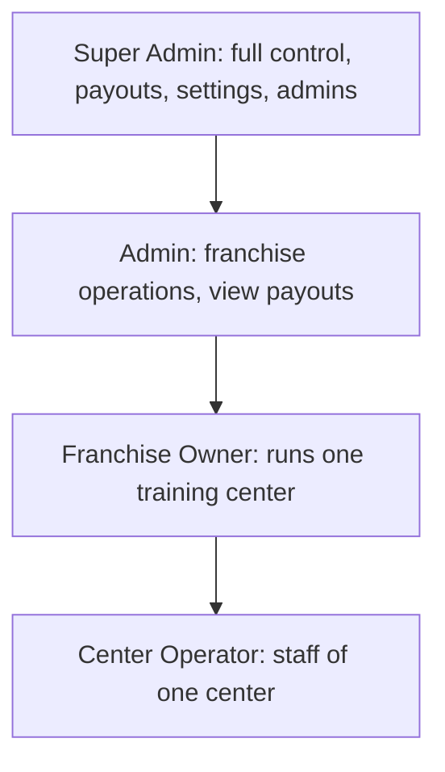
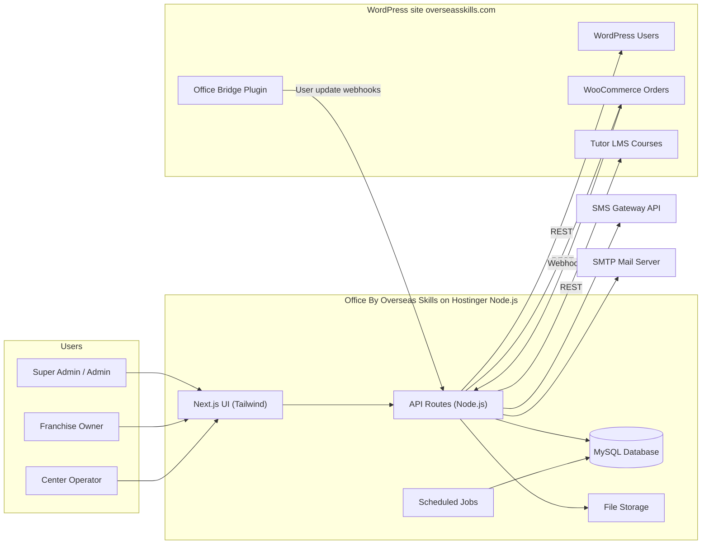
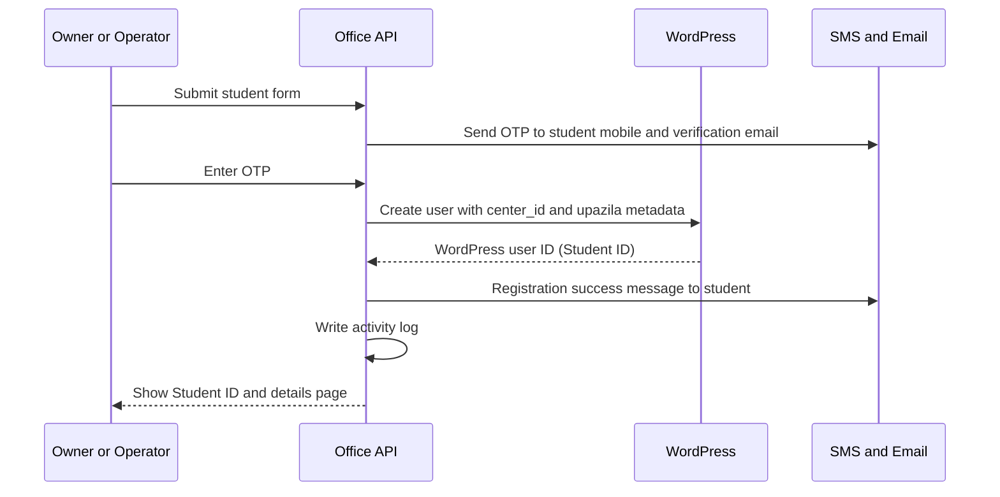
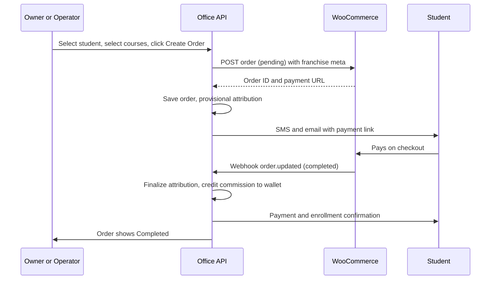
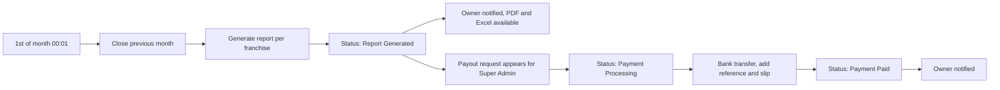
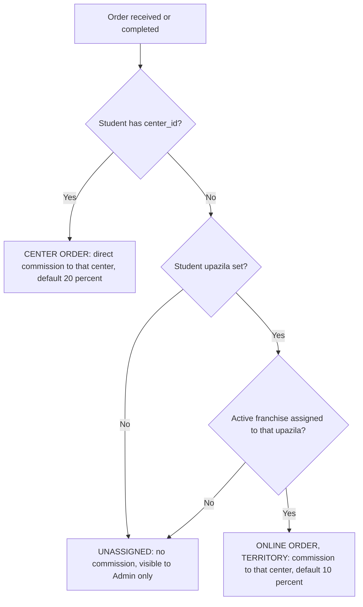
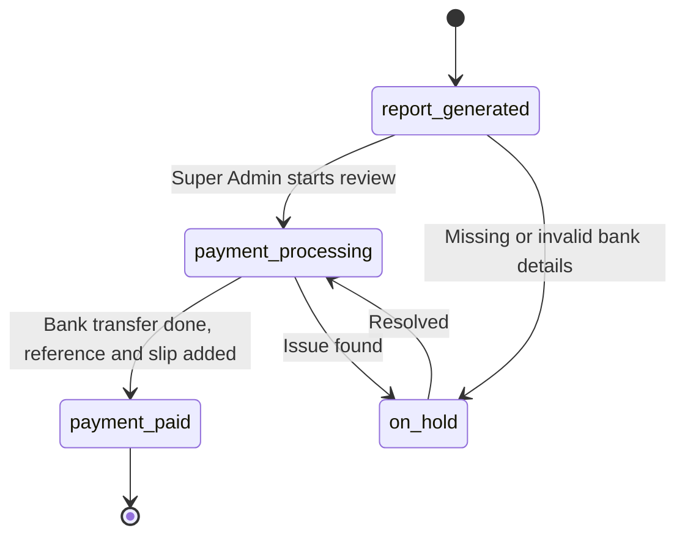
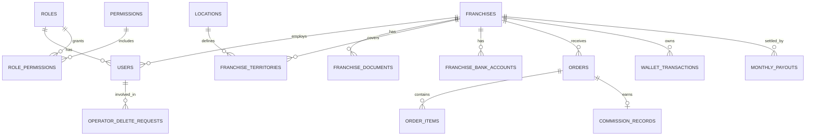

# Product Requirements Document (PRD)

## Office By Overseas Skills
### Franchise & Training-Center Office Management System

| | |
|---|---|
| **Product URL** | https://office.overseasskills.com |
| **Main learning platform** | https://overseasskills.com (WordPress + WooCommerce + Tutor LMS) |
| **Document version** | 1.0 (Draft for client review) |
| **Date** | 21 September 2026 |
| **Status** | Ready for review and sign-off |
| **Source material** | Client discussion notes (Bengali brief) and an earlier draft PRD, consolidated and reconciled in this document |

---

## Table of Contents

1. Executive Summary
2. Scope, Assumptions and Constraints
3. Requirement Reconciliation and Key Design Decisions
4. Users, Roles and Personas
5. System Architecture
6. Technology Stack
7. Core Business Rules
8. Functional Requirements
9. Role-Based Access Control (RBAC) Matrix
10. UI / UX Specification
11. Data Model
12. Integration Specification
13. Internal API Specification
14. Non-Functional Requirements
15. DevOps, Environments and Deployment
16. Testing and Acceptance Criteria
17. Release Plan
18. Risks and Mitigations
19. Open Questions for the Client
20. Appendices

---

# 1. Executive Summary

## 1.1 Purpose

**Office By Overseas Skills** is a standalone back-office and franchise-management platform for the Overseas Skills online learning business. Overseas Skills sells courses on its WordPress learning site. Students can buy directly online, or through physical **training centers** (franchises) that register students and place orders on their behalf. The Office system manages everything around the franchise network:

- Franchise (training center) onboarding, agreements and territories
- Center staff (operators)
- Student registration and course ordering through centers
- Order tracking, commission calculation and wallet balances
- Automated monthly payout reports and settlement
- SMS and email notifications, and full activity and communication logs
- Analytics and reporting for head office and centers

## 1.2 Problem Statement

Today, franchise sales, commissions and payouts have no dedicated system. Head office cannot easily see which center produced which sale, commissions are hard to compute and audit, and centers have no transparent view of their earnings. Adding this logic to WordPress would make the learning site heavier, riskier to change and harder to secure.

## 1.3 Product Vision

A professional, simple and transparent management system where:

- **Head office** controls the franchise network, sees all sales and commissions, and settles payouts once a month.
- **Franchise owners** run their training center, register students, place orders, see their commission and receive automatic monthly statements.
- **Operators** do the daily center work (registration, ordering, tracking) without any access to money-related features.
- **WordPress remains the single source of truth** for student identity, courses and checkout. The Office system reads and writes to it through APIs and webhooks, and keeps its own separate database for franchise data, orders, commissions and history.

## 1.4 Objectives and Success Metrics

| # | Objective | Success metric |
|---|---|---|
| O1 | Fully separate franchise back-office from WordPress | Zero franchise tables or plugins added to the WordPress database beyond one small bridge plugin |
| O2 | Accurate, automatic commissions | 100% of completed orders produce exactly one commission record, and no duplicates. Nightly reconciliation shows 0 mismatches against WooCommerce |
| O3 | Timely monthly settlement | Payout reports for all active centers generated by 00:15 (Asia/Dhaka) on the 1st of every month |
| O4 | Transparency for centers | Owners can see order status, commission and payout status without contacting head office |
| O5 | Efficient center operations | A student can be registered and a payment link issued in under 2 minutes |
| O6 | Reliable communication | At least 98% of triggered SMS/email are delivered, and 100% of attempts are logged |
| O7 | Performance | p95 page load under 2 seconds and p95 API response under 800 ms at target load |

---

# 2. Scope, Assumptions and Constraints

## 2.1 In Scope (Version 1)

1. Authentication and account security for four internal roles.
2. Role and permission management.
3. Super Admin and Admin panel: dashboard, admin management, franchise management, territory management, operator delete-request queue, unassigned orders, commission settings, monthly payouts, reports, general settings, and logs.
4. Franchise Owner panel and Center Operator panel (one shared codebase, permission-gated).
5. Student registration (creates WordPress accounts through the API).
6. Course order creation (creates WooCommerce orders and payment links through the API).
7. Order synchronization from WooCommerce through webhooks into the Office database.
8. Commission engine, wallet ledger, monthly payout reports and settlement workflow.
9. SMS (API) and email (SMTP) notification engine with templates and logs.
10. Activity (audit) logs with 30-day automatic deletion.
11. Reports and analytics with export to PDF/Excel/CSV.
12. System settings: site name, URL, logo, timezone, gateway credentials and other general settings.

## 2.2 Out of Scope (Version 1)

- Student login or a student portal (students continue to use the WordPress site).
- Course creation, video hosting or course content (remains in WordPress and Tutor LMS).
- Online payment gateway handling (remains in WooCommerce checkout).
- Automated bank transfers (head office pays manually and records the payment).
- Native mobile apps (the web app is fully responsive).
- Franchise owner self-registration (owners are created manually by head office).

## 2.3 Assumptions

- WordPress, WooCommerce and Tutor LMS remain unchanged in behavior. The only WordPress addition is a small **bridge plugin** (see Section 5.4).
- Students are identified by their WordPress user ID (the "Student ID").
- Head office has, or will procure, an SMS gateway with an HTTP API and an SMTP mailbox.
- Bangladesh administrative geography (Division, District, Upazila) is used for franchise territories.
- All money is in Bangladeshi Taka (BDT, ৳).
- Default timezone is Asia/Dhaka and is changeable from settings.

## 2.4 Constraints

- **Database:** MySQL, hosted in Hostinger hPanel.
- **Hosting:** Hostinger Node.js application. Code lives in a GitHub repository (used for development and testing first, then deployed from Hostinger).
- **File storage:** Hostinger hosting File Manager.
- **Architecture:** API-based, simple, professional. Separate codebase, database and root directory from WordPress.

## 2.5 Dependencies

| Dependency | Needed for | Owner |
|---|---|---|
| WordPress REST API with Application Password or JWT | Student creation, user lookup | Client / WP admin |
| WooCommerce REST API v3 keys and webhooks | Order creation, order sync | Client / WP admin |
| Tutor LMS API or bridge-plugin endpoints | Course list, enrollments, progress | Client / WP admin |
| WordPress bridge plugin | Metadata exposure, filtered student lists, user webhooks | Development team |
| SMS gateway account (API key, sender ID) | SMS and OTP | Client |
| SMTP mailbox | Transactional email | Client |
| Bangladesh Division/District/Upazila master data | Territory matching | Development team |

---

# 3. Requirement Reconciliation and Key Design Decisions

The client brief and the earlier draft PRD were compared line by line. This section records every place where they differed or where the brief was ambiguous, and the decision taken in this document. Items marked **Confirm** also appear in Section 19.

| # | Topic | Brief / draft said | Decision in this PRD |
|---|---|---|---|
| D1 | Operator and money | The brief says the operator can do everything the owner can, except withdraw payments and add payment methods. It also says operators get no commission. The draft hides wallet and commission from the operator entirely. | Operators get the owner's operational and analytics views, but **no wallet, commission amounts, bank details or payout pages**. Order and sales analytics stay visible. A Super Admin setting can expose per-order commission to operators later. **Confirm** |
| D2 | Who pays the payouts | The brief says Super Admin accepts payment requests and Admin can view them. | **Super Admin** moves a payout through the statuses. **Admin** has view-only access. **Confirm** |
| D3 | Who approves operator deletion | The brief says the request goes to "admin". | **Admin and Super Admin** can both approve or reject. |
| D4 | Student database | The brief says no student database, because student data comes live from WordPress. | Followed. Student and course data are read live from WordPress/Tutor through the API, with a short-lived cache. Orders store only a **name/phone snapshot** for reporting. |
| D5 | Separate table for unassigned orders | The brief says orders with no franchise go to a separate table visible only to Admin. | Implemented as **one `orders` table with `franchise_id = NULL`**, with a hard access rule and a dedicated Admin-only "Unassigned Orders" page. This meets the requirement without duplicating data. A physically separate table can be used if the client insists. |
| D6 | Fixed vs. configurable rates | The brief fixes 20% and 10%, but also says each franchise owner can have their own commission. | **20% (direct) and 10% (territory)** are system defaults. Each franchise can have its own rates, with changes applying only to future orders. |
| D7 | When commission is earned | The brief says the owner gets commission "immediately on order", and the draft says on completion. | Attribution is **provisional when the order is created** and **final when the order status becomes Completed**. Commission is credited to the wallet at completion. |
| D8 | Payout timing | The brief mentions both "last day of month" and "1st of month". | The report covering the **previous calendar month** is generated automatically at **00:01 on the 1st** (Asia/Dhaka). The period closes at 23:59:59 on the last day. |
| D9 | Log deletion | The brief says logs are deleted after 30 days. | Applies to **activity logs and SMS/email logs only**. Financial records (orders, commissions, wallet ledger, payouts) are **never auto-deleted**. Retention days are a setting (default 30). |
| D10 | Sending passwords by SMS | The draft sends login credentials by SMS and email. | New users receive a **one-time set-password link** (or a temporary password that must be changed on first login). Passwords are never stored in plain text or logged. |
| D11 | jQuery / Ajax | The brief lists jQuery and Ajax. | Next.js with React uses `fetch` and a data-fetching library instead. jQuery is not needed and would fight React. Ajax-style behavior is achieved through API calls. |
| D12 | "Animeton" | The brief lists "Animeton". | Interpreted as an animation library (Anime.js). **Confirm** the intended library. AOS is used only on public-facing pages (login) to keep dashboards fast. |
| D13 | Student data for center | The brief says students belong to a center through metadata. | Students carry `center_id` and `upazila` metadata in WordPress. Operators and owners see only students whose `center_id` equals their center. |
| D14 | Deleting franchises | The brief says Admin cannot delete franchises. | Franchises with any orders or ledger history **cannot be hard-deleted by anyone**. Super Admin can archive them. |

---

# 4. Users, Roles and Personas

## 4.1 Role Hierarchy



Head office creates Admins (Super Admin only), and Franchise Owners (Admin or Super Admin). Owners create their own Operators.

## 4.2 Personas

| Role | Who they are | Main goals | Main frustrations today |
|---|---|---|---|
| **Super Admin** | Head-office owner or director | Total control, trust in numbers, paying centers correctly, adding and controlling admins | No consolidated view, manual commission work |
| **Admin** | Head-office staff | Onboard and support franchises, monitor sales, handle requests | Chasing information, spreadsheets |
| **Franchise Owner** | Training-center owner | Grow enrollments, see earned commission, get paid on time, manage staff | No transparency on earnings and statuses |
| **Center Operator** | Center employee at the front desk | Register students fast, create orders, send payment links, check status | Slow manual steps, unclear order status |
| **Student** (external, no login) | Learner | Register easily, pay, receive confirmation, access course | Not knowing whether the payment or enrollment went through |

## 4.3 Role Capability Summary

- **Super Admin:** everything. In addition, only the Super Admin can create, edit or suspend Admins, change system settings, and accept and pay payout requests.
- **Admin:** create and edit franchises, set territories and commission rates, change franchise status (no delete), manage operators, review delete requests, view all students, orders, commissions, reports and logs, view payouts.
- **Franchise Owner:** own-center dashboard, register students, place orders, manage operators (create, edit, change status, request delete), view student details and progress, view commissions, wallet, payouts and reports, manage own bank details, view operator activity logs.
- **Center Operator:** same operational features as the owner (register students, place orders, view students, orders, analytics and reports), **without** wallet, commission, bank details, payouts, operator management or franchise management.

---

# 5. System Architecture

## 5.1 Architecture Principles

1. **Decoupled:** the Office system is a completely separate application, with its own database, its own code root and its own deployment.
2. **WordPress is the source of truth for identity, courses and checkout.** Office is the source of truth for franchises, commissions, wallet, payouts and franchise-side history.
3. **Push over pull:** WooCommerce pushes order events to Office via webhooks. Office does not poll WordPress for every order. WordPress receives only the requests it must serve (create a student, create an order, read a student or course).
4. **API-first:** every function is exposed as an internal API route. The UI is a client of those routes.
5. **Simple and professional:** one deployable Next.js application, one MySQL database, small well-named modules.

## 5.2 High-Level Diagram



## 5.3 Key Data Flows

### Flow A: Student registration through a center



### Flow B: Course order and payment



### Flow C: Monthly settlement



## 5.4 WordPress Bridge Plugin ("Office Bridge")

The default WordPress REST API cannot reliably filter users by custom metadata, expose custom meta, or push user-update events. A small, single-purpose plugin is therefore required on the WordPress side. It is the only change made to WordPress.

| Function | Detail |
|---|---|
| Register user meta | Exposes `center_id`, `upazila`, and `onboarded_by_operator` to REST (read and write for authorized calls) |
| Filtered student list | `GET /wp-json/office/v1/students?center_id=&search=&page=` returns students of a center |
| Student progress | `GET /wp-json/office/v1/students/{id}/courses` returns enrolled courses, progress % and completion state from Tutor LMS |
| Course catalog | `GET /wp-json/office/v1/courses?search=` returns purchasable courses with product ID, price and thumbnail |
| User webhooks | Sends signed events to Office on user creation and profile update |
| Registration form support | Adds a Division, District, Upazila dropdown to the website signup form so direct registrants carry a valid `upazila` value |
| Security | Endpoints require an application password or shared HMAC secret. Every request is rate-limited |

If the Tutor LMS REST API already exposes the required data in the client's version, the bridge endpoints may simply wrap it. This must be verified during Discovery (Section 17).

## 5.5 Metadata Contract (WordPress user meta)

| Meta key | Value | Set by | Purpose |
|---|---|---|---|
| `center_id` | Center code, e.g. `FC-DHK-01` | Office (center registrations only) | Marks the student as a center student |
| `upazila` | Upazila code from Office master list | Office or WP signup form | Territory matching for online students |
| `onboarded_by_operator` | Office user ID | Office | Traceability |
| `registration_source` | `center` or `website` | Office or bridge plugin | Reporting |

Rules:
- `center_id` is written **only** by Office at registration time. It cannot be edited by owners, operators or students. Changing it is an Admin-only correction with an audit entry.
- Center codes are immutable once created.

## 5.6 Deployment View

- One Next.js application on a Hostinger Node.js app, serving both UI and API routes.
- One Hostinger MySQL database.
- Private file storage (agreements, KYC, payment slips) outside the public web root, served through authenticated download routes.
- Scheduled jobs are triggered by **Hostinger hPanel Cron Jobs** calling protected internal endpoints. This is more reliable than in-process timers, which are lost when a Node app restarts.

---

# 6. Technology Stack

| Layer | Technology | Notes |
|---|---|---|
| Frontend framework | Next.js (App Router), React | Server components where useful |
| Styling | Tailwind CSS | Design tokens in Section 10 |
| Icons and graphics | Font Awesome, inline SVG | |
| Animation | AOS (public pages), a light animation library for micro-interactions | Kept minimal in dashboards |
| Charts | Recharts or Chart.js | Dashboards and analytics |
| Backend | Next.js API routes on Node.js | All features are API-based |
| Database | MySQL (Hostinger hPanel) | UTF8MB4, InnoDB |
| Data access | Prisma or Drizzle ORM with versioned migrations | To be chosen in Sprint 0 |
| Validation | Zod (shared between client and server) | |
| Authentication | Secure HTTP-only cookie session or short-lived JWT plus refresh token, argon2id/bcrypt hashing | |
| Email | Nodemailer over SMTP | |
| SMS | HTTP API adapter (provider-agnostic) | Provider set in settings |
| PDF and Excel | Server-side PDF generation and ExcelJS | Payout and report exports |
| File storage | Hostinger File Manager path, private directory | |
| Source control | GitHub repository | Development, testing, and CI |
| Hosting | Hostinger Node.js application | Production |
| Scheduling | Hostinger Cron Jobs to secured API endpoints | Idempotent jobs |

Design choice: a **provider adapter** pattern for SMS so the gateway can be changed from Settings without code changes.

---

# 7. Core Business Rules

This section is the single authoritative definition of the business logic. All later sections implement it.

## 7.1 Order Channels and Attribution

Every order belongs to exactly one **attribution type**, decided from the student's WordPress metadata.



| Attribution type | Condition | Commission | Visible to |
|---|---|---|---|
| `direct_center` (Center Order) | Student has a `center_id` | Center's direct rate (default 20%) | Head office and that center |
| `upazila_territory` (Online Order in territory) | No `center_id`; student's upazila has an active franchise | Center's territory rate (default 10%) | Head office and that center |
| `no_commission` (Unassigned) | No `center_id`, and no upazila or no franchise in that upazila | 0% (full amount to company) | **Head office only** |

Clarifications from the brief:
- A student registered **through a center** is a center student for life. This is true even when the student later orders directly on the website. Those orders are Center Orders.
- Students who register **directly on the website** have no `center_id` and are **Online** students. Their orders are checked for territory commission.
- Center Orders and Territory Orders are shown as two separate categories in all analytics ("Center Orders" and "Online Orders").
- An order created from a franchise panel is still attributed by the **student's metadata**, not by which operator clicked the button.

## 7.2 Commission Calculation

- **Commission base (default):** order subtotal after discounts, excluding tax and shipping, using the **amount actually paid**. **Confirm**
- **Formula:** `commission = base × rate ÷ 100`, rounded to 2 decimals (half-up).
- **Rate source:** the franchise's own `direct_commission_rate` or `territory_commission_rate` at the time of completion. Defaults are 20 and 10. Rate changes apply only to orders completed afterward.
- **Trigger:** order status transition to `completed` (configurable set of trigger statuses in Settings). Commission is calculated once per order. A unique constraint on `order_id` prevents duplicates.
- **Snapshot:** the rate, base, amount, attribution type and franchise are stored on the commission record and never recalculated.
- **Provisional attribution:** while an order is pending, the order screen shows expected attribution. It becomes final at completion.
- **Refunds and cancellations:** if a completed order becomes `refunded`, a reversal entry (negative) is written to the wallet ledger for the commission amount, proportional for partial refunds. If the amount was already paid out, the reversal is deducted from the next payout.
- **Inactive franchises:** when a franchise is inactive or suspended, logins are blocked. Commission continues to accrue for center orders, and payouts are held until the franchise is reactivated. Territory commission is not earned by inactive franchises. **Confirm**
- **Exclusive territory:** an upazila can be assigned to **one active franchise at a time** (enforced by a unique constraint). **Confirm**

## 7.3 Wallet

The wallet is a **ledger**, and the balance is always derived from the ledger, never stored as an editable number.

| Ledger entry type | Effect | Created by |
|---|---|---|
| `commission_credit` | + | Commission engine at order completion |
| `commission_reversal` | − | Refund handling |
| `payout_lock` | Moves closed-month amount to "Pending payout" | Monthly job |
| `payout_paid` | Clears pending amount and adds to lifetime withdrawn | Super Admin marking Paid |
| `adjustment` | ± | Super Admin only, with mandatory reason, fully audited |

Wallet page shows: current-month accrued commission, pending payout, last month paid, this month paid, and total withdrawn (lifetime).

There is **no manual withdrawal button and no minimum threshold**. Settlement is fully automatic and monthly.

## 7.4 Monthly Payout Cycle

1. At **00:01 on the 1st** (system timezone), a job closes the previous month.
2. For each franchise with accrued commission, it creates one `monthly_payouts` record with a unique report reference (e.g. `REP-2026-09-FC-DHK-01`), order count, sales volume, payout amount, and a **snapshot of bank details**.
3. The job generates the PDF and Excel statement, moves the amount to "Pending payout", notifies the owner, and raises a payout request in the Super Admin and Admin panels.
4. Payout status flow:



5. Franchise owners can only **view and download**. They cannot change status.
6. If the payout amount is zero, a statement is still generated with status `no_payout` and no request is raised.
7. The job is **idempotent**: re-running it for the same month never creates duplicates.
8. Bank changes made by an owner after report generation apply to the **next** cycle, since the report holds the bank snapshot.

## 7.5 Operator Deletion Rule

- Owners and operators **cannot delete** an operator. The owner presses Delete, gives a reason, and a **Deletion Request** is created with status `pending`.
- Admin or Super Admin approves or rejects. Approval performs a **soft delete** (account disabled, login blocked, kept for history and audit). Rejection requires a comment and notifies the owner.
- The operator remains active while the request is pending unless the owner suspends them.

## 7.6 Status Change Rules

| Entity | Statuses | Who can change |
|---|---|---|
| Franchise | `pending_approval`, `active`, `inactive`, `suspended`, `archived` | Admin, Super Admin (archive: Super Admin only) |
| Operator | `active`, `suspended`, `deleted` (soft) | Owner (active and suspended), Admin and Super Admin (all, delete on approval) |
| Admin account | `active`, `suspended` | Super Admin only |
| Payout | `report_generated`, `payment_processing`, `payment_paid`, `on_hold`, `no_payout` | Super Admin only |
| Order | Mirrors WooCommerce | Not editable in Office. Changes come only through WooCommerce |

## 7.7 Student Data Rule

Owners and operators may **view** all student data of their own center but **cannot edit or modify** it. Student profile changes happen in WordPress. Only registration and course ordering are performed from Office.

## 7.8 Duplicate and Ownership Protection

- Registering a student whose mobile or email already exists in WordPress is blocked with a clear message. A center can never take over an existing student's `center_id`, since that would redirect commission.
- Only an Admin, with an audit entry, may correct a student's center assignment.

---

# 8. Functional Requirements

Priority key: **P0** = must have for launch, **P1** = should have for launch, **P2** = later release.

## 8.1 Authentication and Account Security (AUTH)

| ID | Requirement | Priority |
|---|---|---|
| AUTH-01 | Login with email or mobile number plus password for all four roles. | P0 |
| AUTH-02 | There is **no public registration** for franchise owners, operators or admins. Accounts are created only by an authorized creator (Section 4.3). | P0 |
| AUTH-03 | New accounts receive a one-time set-password link (expires in 24 hours). First login forces a password change if a temporary password was used. | P0 |
| AUTH-04 | Password policy: minimum 10 characters, mixed character types, breached or common passwords rejected. Configurable in Settings. | P0 |
| AUTH-05 | Forgot-password via email link, and optionally via SMS OTP. Links and OTPs are single-use and time-limited. | P0 |
| AUTH-06 | Account lockout after 5 failed attempts (15-minute lock, configurable), with rate limiting by IP and account. | P0 |
| AUTH-07 | Session timeout after inactivity (default 30 minutes), "remember this device" optional (7 days). | P1 |
| AUTH-08 | Every successful login sends a **security alert email** to that user (per the brief), including time, device and IP. New-device logins are highlighted. | P0 |
| AUTH-09 | Login history is recorded (time, IP, device, result) in the activity log. | P0 |
| AUTH-10 | Optional two-factor authentication (SMS OTP or authenticator app), enforceable per role from Settings. Recommended for Super Admin. | P2 |
| AUTH-11 | Users can view and change their own profile (name, phone, email with re-verification) and password. Franchise data itself is read-only for owners. | P0 |
| AUTH-12 | Suspended or inactive users, and users of inactive franchises, cannot log in and get a clear message. | P0 |

## 8.2 Roles and Permissions (RBAC)

| ID | Requirement | Priority |
|---|---|---|
| RBAC-01 | Roles are stored in a separate `roles` table, and permissions in a `permissions` table mapped by `role_permissions`. | P0 |
| RBAC-02 | The four built-in roles are seeded with the matrix in Section 9. | P0 |
| RBAC-03 | **All authorization is enforced on the server.** Hiding a button is never the only control. | P0 |
| RBAC-04 | **Data scoping:** every query for Owner and Operator roles is automatically filtered by their `franchise_id`. A user can never read or write another center's data, even by guessing IDs. | P0 |
| RBAC-05 | Super Admin can edit the permission mapping of the Admin, Owner and Operator roles from a permission-matrix screen, with audit logging. Built-in safety rules (for example operators never see bank data) cannot be removed. | P2 |
| RBAC-06 | Sensitive actions (change commission rate, change bank details, approve payout, adjust wallet) require re-entering the password. | P1 |

## 8.3 Super Admin and Admin Panel (HO)

### 8.3.1 Executive Dashboard (HO-DASH)

| ID | Requirement | Priority |
|---|---|---|
| HO-DASH-01 | KPI cards: total sales (today, month, all-time), orders by status, active franchises, total students onboarded through centers, commission accrued this month, pending payouts amount. | P0 |
| HO-DASH-02 | Charts: sales trend (7/30/90 days, monthly), Center Orders vs Online Orders, top 10 franchises by sales, top courses, student onboarding trend. | P0 |
| HO-DASH-03 | Alerts panel: pending operator-delete requests, payout requests awaiting action, unassigned orders count, failed notifications, failed webhooks, franchises with missing bank details. | P0 |
| HO-DASH-04 | Global date-range filter and franchise filter for the dashboard. | P1 |
| HO-DASH-05 | Geographic view (district or upazila heat table) of sales and center coverage. | P2 |

### 8.3.2 Admin Management (Super Admin only) (HO-ADM)

| ID | Requirement | Priority |
|---|---|---|
| HO-ADM-01 | Create admin: name, email, mobile, initial password/set-password link, status. | P0 |
| HO-ADM-02 | List, search, view, edit and suspend admins. Admins cannot see or edit other admins. | P0 |
| HO-ADM-03 | Per-admin activity history view. | P1 |
| HO-ADM-04 | Admin accounts can never be hard-deleted. They are suspended or archived to preserve audit trails. | P0 |

### 8.3.3 Franchise (Training Center) Management (HO-FR)

| ID | Requirement | Priority |
|---|---|---|
| HO-FR-01 | **Create franchise** in one guided form: center name, auto-generated unique **Center Code** (pattern configurable, e.g. `FC-DHK-01`), Division, District, Upazila, full address, official phone, official email. | P0 |
| HO-FR-02 | Owner information: name, mobile, email, NID number, date of birth, photo, present and permanent address. | P0 |
| HO-FR-03 | Documents upload: agreement, deal document, NID copy, trade license and other files (PDF/JPG/PNG, size limit configurable). Documents are private and versioned. | P0 |
| HO-FR-04 | On save, the system **creates the owner's user account** and sends set-password instructions by SMS and email, and notifies the creating admin. | P0 |
| HO-FR-05 | Commission configuration per franchise: direct rate and territory rate (defaults 20% / 10%), effective-from date, with a rate-change history. | P0 |
| HO-FR-06 | Territory assignment: choose the upazila(s) covered by the franchise. Conflicts with another active franchise are blocked. | P0 |
| HO-FR-07 | Franchise list: search, filters (division, district, upazila, status), columns for code, name, owner, upazila, students, orders, wallet balance, status, and a **status toggle**. | P0 |
| HO-FR-08 | Franchise detail page with tabs: Overview, Owner and Documents, Operators, Students, Orders, Commission and Wallet, Payouts, Activity Log. | P0 |
| HO-FR-09 | Edit franchise (Admin and Super Admin). **No delete.** Super Admin may archive a franchise. | P0 |
| HO-FR-10 | Status change with reason (Active, Inactive, Suspended). Effects are defined in Section 7.2. Owner and operators are notified. | P0 |
| HO-FR-11 | Franchise-level notes and internal remarks (head-office only). | P1 |
| HO-FR-12 | Agreement expiry date with renewal reminders to head office. | P2 |

### 8.3.4 Operator Oversight and Delete Requests (HO-OP)

| ID | Requirement | Priority |
|---|---|---|
| HO-OP-01 | Head office can view, create and edit any operator (name, mobile, email, status). | P0 |
| HO-OP-02 | **Delete Request Queue:** list of requests from owners with operator, center, reason and date. Approve (soft-delete) or Reject (with comment). | P0 |
| HO-OP-03 | Decision notifies the requesting owner by SMS and email. Logged. | P0 |

### 8.3.5 Orders, Unassigned Orders and Commissions (HO-ORD)

| ID | Requirement | Priority |
|---|---|---|
| HO-ORD-01 | All-orders list with filters: date, status, franchise, channel (Center / Online), attribution type, course, student, amount. Export to Excel/CSV. | P0 |
| HO-ORD-02 | Order detail: student snapshot, courses, totals, WooCommerce order link, payment status, attribution, commission record, status history, notifications sent. | P0 |
| HO-ORD-03 | **Unassigned Orders page (Admin and Super Admin only):** orders with no center and no territory match, with the reason. Head office can manually assign a student's center or upazila through a corrective action (audited). Reassignment applies to future orders only unless approved by Super Admin. | P0 |
| HO-ORD-04 | Commission ledger across all centers with filters and totals. | P0 |
| HO-ORD-05 | Commission rate changes are audited and notify the Super Admin when made by an Admin. | P1 |

### 8.3.6 Monthly Payouts and Settlement (HO-PAY)

| ID | Requirement | Priority |
|---|---|---|
| HO-PAY-01 | Payout list showing report reference, franchise, month, orders, sales volume, payable amount, bank snapshot, status, generated date, paid date. Filters by month, status and franchise. | P0 |
| HO-PAY-02 | Payout detail with full statement (order-level lines, reversals, totals), owner bank snapshot, downloadable PDF/Excel. | P0 |
| HO-PAY-03 | **Super Admin** actions: Start Processing, Mark Paid (requires bank transaction reference, payment date and optional slip upload), Put On Hold (requires reason). Each action is audited and notifies the owner. | P0 |
| HO-PAY-04 | **Admin** sees payouts as view-only. | P0 |
| HO-PAY-05 | Payout history and analytics: paid this month, paid last month, total paid, outstanding. | P1 |
| HO-PAY-06 | Warnings for payouts that have stayed in the same status longer than N days (configurable). | P1 |
| HO-PAY-07 | Manual re-generation of a failed month's report by Super Admin, protected against duplicates. | P1 |

### 8.3.7 Reports (HO-REP)

See Section 8.13.

### 8.3.8 System Settings (Super Admin only) (HO-SET)

See Section 8.14.

### 8.3.9 Logs (HO-LOG)

See Section 8.12.

## 8.4 Franchise Owner Panel (FO)

| ID | Requirement | Priority |
|---|---|---|
| FO-DASH-01 | Dashboard cards: today's orders, today's sales (৳), today's commission (৳), wallet balance, pending orders, active students, students onboarded this month. | P0 |
| FO-DASH-02 | Charts: sales for last 7 and 30 days, Center Orders vs Territory (online) Orders, order status breakdown. | P0 |
| FO-DASH-03 | Top-selling courses table and recent orders list. | P0 |
| FO-PRO-01 | **Franchise Profile (read-only):** center code, name, address, upazila, owner name, NID, agreement documents (download), commission rates. Notice: "To change any information, please contact head office." | P0 |
| FO-PRO-02 | Owner can change own password and contact preferences. | P0 |
| FO-OPM-01 | **Operator management:** list, add operator (name, mobile, email, initial credentials via set-password link), edit name, mobile, email, and change status (Active / Suspended). | P0 |
| FO-OPM-02 | **Delete** button creates a Deletion Request to head office (Section 7.5). The list shows "Deletion requested" with the request status. | P0 |
| FO-OPM-03 | Operator activity view: see everything each operator did in the last 30 days (students registered, orders created, payment links sent, orders completed). | P0 |
| FO-STU-01 | **Student directory:** all students of the center with search (name, mobile, Student ID, username), filters, sorting, pagination. | P0 |
| FO-STU-02 | **Student details page** (read-only): name, mobile, username, email, registration date, registered-by (owner/operator), total orders, orders by status, full order history, enrolled courses count, completed courses count, per-course progress. | P0 |
| FO-REG-01 | **Student registration** (Section 8.6). | P0 |
| FO-ORD-01 | **Create course order** (Section 8.7). | P0 |
| FO-ORD-02 | Order list and detail with filters (date, status, operator, student, course). Payment link shown for pending orders with copy, open, and resend by SMS/email. | P0 |
| FO-COM-01 | **Commission ledger:** per order commission amount, rate, type (Direct or Territory), and order status. Totals by day, month, and type. | P0 |
| FO-WAL-01 | **Wallet page:** current-month accrued commission, pending payout, this month withdrawn, last month withdrawn, total withdrawn, wallet transaction history. | P0 |
| FO-WAL-02 | **Bank details:** owner adds or edits bank name, branch, routing number, account name and account number. Changes are logged, verified by password re-entry, and notify head office. | P0 |
| FO-PAY-01 | **Monthly payouts:** list of statements with live status (Report Generated, Processing, Paid, On Hold), download PDF/Excel, payment reference and date once paid. No action buttons. | P0 |
| FO-REP-01 | Reports for the center (Section 8.13). | P0 |
| FO-LOG-01 | Activity logs for own center (last 30 days). | P0 |

## 8.5 Center Operator Panel (OP)

The Operator panel is the same application and same pages as the Owner panel, **filtered by permissions**.

| ID | Requirement | Priority |
|---|---|---|
| OP-DASH-01 | Operations dashboard: today's registrations, total students of the center, pending orders, completed orders today, and recent orders. **No commission, wallet or payout information anywhere.** | P0 |
| OP-STU-01 | Same student directory and read-only student details page as the owner. | P0 |
| OP-REG-01 | Student registration, same as the owner. | P0 |
| OP-ORD-01 | Course order creation and payment link handling, same as the owner. | P0 |
| OP-ORD-02 | Order history and payment verification: pending, completed and cancelled orders with status. | P0 |
| OP-REP-01 | Operational reports and analytics (students, orders, courses, sales), exportable. Financial commission reports are excluded. | P0 |
| OP-PRO-01 | Own profile and password change. | P0 |
| OP-DENY-01 | Operators **cannot**: see wallet, commission amounts, bank details or payouts; add or edit payment methods; manage operators; view franchise agreements; create, edit or delete franchises; view logs of other users. Any direct URL or API attempt returns "Access denied" and is logged. | P0 |
| OP-TASK-01 | Follow-up task list (call a student who has not paid, reminders). | P2 |

## 8.6 Student Registration (REG)

Available to Owner and Operator. Submitting creates a real WordPress account.

| ID | Requirement | Priority |
|---|---|---|
| REG-01 | **Form fields:** full name, mobile number (Bangladesh format validated), email, address, Division, District, Upazila (cascading dropdowns), date of birth and gender (optional), optional photo. The `center_id` is set automatically and is not editable. | P0 |
| REG-02 | **Verification:** SMS OTP sent to the student's mobile and email verification link, both to confirm the student owns the contact details. The center enters the OTP given by the student. Both checks can be toggled in Settings. | P0 |
| REG-03 | Duplicate check against WordPress (mobile, email, username) **before** creation, with friendly error messages. | P0 |
| REG-04 | On success, Office calls WordPress to create the user with student role and metadata `center_id`, `upazila`, `onboarded_by_operator`, `registration_source = center`. | P0 |
| REG-05 | **Student ID** is the WordPress user ID, generated by WordPress and not by Office. Office displays it after success. | P0 |
| REG-06 | The system sends the student SMS and email: "Your registration through [Center Name] at Overseas Skills was successful", including login and password-setup instructions. | P0 |
| REG-07 | Activity log entry (who, which student, when). | P0 |
| REG-08 | After success, offer "Create order for this student" as the next action. | P1 |
| REG-09 | If the WordPress call fails, nothing is partially saved. The user sees a clear message and can retry. Failed attempts are logged. | P0 |
| REG-10 | Bulk registration by CSV upload. | P2 |

## 8.7 Course Order Engine (ORD)

Available to Owner and Operator.

| ID | Requirement | Priority |
|---|---|---|
| ORD-01 | **Step 1, select student:** search by Student ID, mobile, name or username, limited to students of the user's own center. | P0 |
| ORD-02 | **Step 2, select courses:** live search of the WordPress/Tutor/WooCommerce catalog. One or more courses can be added. The catalog shows title, price and thumbnail. | P0 |
| ORD-03 | **Step 3, review and create:** order summary with student details, courses and total, then a **Create Order** button. | P0 |
| ORD-04 | On click, Office creates a **pending** WooCommerce order for the student with meta `_created_via_franchise` (center code) and `_operator_id`. | P0 |
| ORD-05 | Payment URL comes from the WooCommerce response and is shown immediately in the order page. It can be copied, opened, shared, and sent to the student by SMS and email. | P0 |
| ORD-06 | The order appears in the center's order list with status **Pending** and remains as history. | P0 |
| ORD-07 | When the student pays, WooCommerce completes the order, enrolls the student, and a webhook tells Office. The order shows **Completed** everywhere. | P0 |
| ORD-08 | Duplicate protection: warn if the same student already has a pending order for the same course. | P1 |
| ORD-09 | Payment link expiry handling and regeneration. | P1 |
| ORD-10 | Failure handling: if WooCommerce is unreachable, the user sees a clear message and no local order is created. Failed attempts are logged. | P0 |
| ORD-11 | Orders cannot be edited or cancelled from Office in Version 1. A request-cancel flow can follow later. | P2 |

## 8.8 Order Synchronization (SYNC)

| ID | Requirement | Priority |
|---|---|---|
| SYNC-01 | WooCommerce webhooks `order.created` and `order.updated` post to `/api/webhooks/woocommerce/order`. Signature (`X-WC-Webhook-Signature`, HMAC-SHA256) is **verified** before processing. Invalid requests are rejected and logged. | P0 |
| SYNC-02 | Incoming events are stored in a `webhook_events` inbox and processed **idempotently**. Duplicate deliveries do not create duplicate orders or commissions. | P0 |
| SYNC-03 | Orders from **any source** (panel or website) are imported, so head office sees the complete picture. Attribution is determined per Section 7.1. | P0 |
| SYNC-04 | Office does not call WordPress for order details on page views. Everything is served from the Office database. | P0 |
| SYNC-05 | **Nightly reconciliation job** compares the last 48 hours of WooCommerce orders with Office and repairs gaps. It also runs on demand. This protects against missed webhooks, since WooCommerce disables a webhook after repeated delivery failures. | P0 |
| SYNC-06 | Health monitor: alert head office when no webhook has arrived for an unusual period or webhook status turns "disabled". | P1 |
| SYNC-07 | Student and progress data are fetched live from WordPress/Tutor and cached briefly (default 5 minutes) for speed. | P0 |

## 8.9 Commission Engine (COM)

| ID | Requirement | Priority |
|---|---|---|
| COM-01 | When an order becomes `completed`, run the attribution algorithm (Section 7.1) and calculate commission (Section 7.2). | P0 |
| COM-02 | Write one `commission_records` row and one `commission_credit` wallet-ledger entry inside a **single database transaction**. | P0 |
| COM-03 | Unique constraint on `order_id` guarantees a single commission per order. | P0 |
| COM-04 | Handle refunds: reversal entries for full and partial refunds (Section 7.2). | P0 |
| COM-05 | Unassigned orders produce a `no_commission` record for reporting and no wallet entry. | P0 |
| COM-06 | Rates and territory used are stored as an immutable snapshot on each record. | P0 |
| COM-07 | Send completion notifications (Section 8.11). | P0 |

## 8.10 Wallet and Payouts (WAL)

| ID | Requirement | Priority |
|---|---|---|
| WAL-01 | Wallet is a ledger (Section 7.3). Direct edits to a balance are impossible. | P0 |
| WAL-02 | Monthly report job as defined in Section 7.4, with distributed lock and idempotency. | P0 |
| WAL-03 | PDF statement contents: report reference, period, franchise and owner details, order lines (order no., date, student, course, order total, rate, commission), reversals, opening and closing figures, total payable, bank snapshot, generated date, and head-office signature/notes area. | P0 |
| WAL-04 | Excel statement with the same data plus a summary sheet. | P0 |
| WAL-05 | Owner analytics: last month withdrawn, this month withdrawn, total withdrawn. | P0 |
| WAL-06 | Payment proof (slip image/PDF) stored privately and visible to the owner once paid. | P1 |

## 8.11 Notification Engine (NTF)

| ID | Requirement | Priority |
|---|---|---|
| NTF-01 | SMS through an HTTP API gateway, and email through SMTP. Both are **managed centrally** from the Office system. | P0 |
| NTF-02 | Event-based triggering with **only useful messages** sent (catalog in Appendix A). Unnecessary messages are avoided. | P0 |
| NTF-03 | Editable templates per event and channel with placeholders (`{student_name}`, `{center_name}`, `{payment_link}`, `{order_no}`, ...). Templates support Bangla (Unicode) and English. | P1 |
| NTF-04 | Per-event on/off switch per channel in Settings. | P1 |
| NTF-05 | Sending is asynchronous through a queue with retries (3 attempts with backoff). A failure never blocks the user action. | P0 |
| NTF-06 | Every attempt is written to `notification_logs` with recipient, channel, template, status and gateway response. | P0 |
| NTF-07 | SMS length and Unicode segment counting, with an estimate of cost in the template editor. | P2 |
| NTF-08 | "Send test SMS" and "Send test email" buttons in Settings. | P0 |
| NTF-09 | OTP messages are rate-limited (for example 3 per number per 10 minutes) with 5-minute expiry and hashed storage. | P0 |

## 8.12 Logging and Audit (LOG)

The brief asks for **many logs, kept for 30 days, then automatically deleted**.

| Log | Content | Visible to | Retention |
|---|---|---|---|
| **Activity (audit) log** | Who did what: logins, student registered, order created, payment link sent, order completed, operator added/edited/status changed, delete request, franchise edits, commission changes, settings changes, payout actions. Includes actor, role, franchise, action, target, before/after values, IP, device, time. | Super Admin and Admin: all. Owner: own center, including every operator's actions. Operator: none | 30 days (setting) |
| **Notification log** | Every SMS and email: channel, recipient, event, content, status, gateway response | Super Admin and Admin | 30 days (setting) |
| **Webhook and sync log** | Incoming and outgoing WordPress/WooCommerce calls, status and errors | Super Admin and Admin | 30 days |
| **Security log** | Failed logins, lockouts, denied access attempts, permission violations | Super Admin and Admin | 30 days |
| **Job run log** | Scheduled job runs (monthly payout, reconcile, cleanup) with result | Super Admin | 90 days |

| ID | Requirement | Priority |
|---|---|---|
| LOG-01 | Logs are stored in separate tables and written asynchronously so they never slow the user action. | P0 |
| LOG-02 | A daily cleanup job (02:00) deletes rows older than the retention setting. | P0 |
| LOG-03 | Filterable log viewers (date, user, role, franchise, action, status, free text) with pagination and CSV export. | P0 |
| LOG-04 | Logs are append-only. Nobody can edit or delete individual entries from the UI. | P0 |
| LOG-05 | **Financial records (orders, commissions, ledger, payouts) are never subject to auto-deletion.** | P0 |
| LOG-06 | Sensitive values (passwords, OTPs, full API secrets) are never written to logs. | P0 |

## 8.13 Reports and Analytics (REP)

| ID | Report | Audience | Filters | Export |
|---|---|---|---|---|
| REP-01 | Sales report | HO, Owner, Operator (own center) | Date range, course, channel, status | PDF, Excel, CSV |
| REP-02 | Order status report | HO, Owner, Operator | Date, status, operator | Excel, CSV |
| REP-03 | Student registration report | HO, Owner, Operator | Date, operator, upazila | Excel, CSV |
| REP-04 | Course performance | HO, Owner, Operator | Date, course | Excel, CSV |
| REP-05 | Commission report | HO, Owner only | Date, franchise, type | PDF, Excel |
| REP-06 | Franchise performance ranking | HO | Date, division, district | Excel |
| REP-07 | Operator activity report | HO, Owner | Date, operator | Excel |
| REP-08 | Payout report and statement history | HO, Owner | Month, status | PDF, Excel |
| REP-09 | Unassigned orders report | HO only | Date, upazila | Excel |
| REP-10 | Center Orders vs Online Orders comparison | HO, Owner | Date | PDF, Excel |
| REP-11 | Scheduled email delivery of reports | HO | Weekly or monthly | Email |

Every report uses server-side pagination, respects role scoping, and has consistent date filters (Today, 7 days, 30 days, This month, Last month, Custom).

## 8.14 System Settings (Super Admin only) (SET)

| Group | Settings |
|---|---|
| **General** | System name (default "Office By Overseas Skills"), **system URL** (default https://office.overseasskills.com), logo, favicon, support email and phone, footer text, **timezone (default Asia/Dhaka)**, date and time format, currency and symbol, default language, number format, maintenance mode |
| **Branding** | Primary and accent colors, login-page image and text |
| **Security** | Password policy, session timeout, lockout thresholds, two-factor enforcement, allowed file types and upload size |
| **WordPress and WooCommerce** | Site base URL, API credentials (encrypted), webhook secret, product-category filter for the course catalog, commission trigger statuses, cache duration |
| **Commission defaults** | Default direct rate (20%), default territory rate (10%), commission base rule, operator commission visibility switch |
| **Payout** | Payout run day and time (default 1st at 00:01), report format, alert-after-days, report reference pattern |
| **SMS gateway** | Provider, API URL, API key/secret (encrypted), sender ID, test-SMS button, per-event toggles, OTP length and expiry |
| **Email (SMTP)** | Host, port, encryption, username, password (encrypted), from name and address, test-email button, per-event toggles |
| **Notifications** | Template editor for every event, channel toggles |
| **Logs and retention** | Retention days (default 30), cleanup schedule |
| **Center codes** | Code pattern and next-number counters |
| **Locations** | Division, District, Upazila master data management |

All secrets are stored **encrypted (AES-256-GCM)**, masked in the UI, and every settings change is written to the audit log. Changes to the system URL and name are reflected in emails, PDFs and the login page immediately.

---

# 9. Role-Based Access Control (RBAC) Matrix

Legend: ✅ full access, 👁 view only, ⚙ limited (see note), ❌ no access.

| Module and action | Super Admin | Admin | Franchise Owner | Operator |
|---|---|---|---|---|
| **Admin management** (create, edit, suspend admins) | ✅ | ❌ | ❌ | ❌ |
| **System settings** | ✅ | ❌ | ❌ | ❌ |
| Permission matrix editing | ✅ | ❌ | ❌ | ❌ |
| **Create franchise** (agreement, KYC, owner account) | ✅ | ✅ | ❌ | ❌ |
| Edit franchise profile | ✅ | ✅ | ❌ (own password only) | ❌ |
| Change franchise status | ✅ | ✅ | ❌ | ❌ |
| Delete franchise | ⚙ Archive only | ❌ | ❌ | ❌ |
| Set commission rates and territories | ✅ | ✅ (audited) | ❌ | ❌ |
| Create operator | ✅ | ✅ | ✅ (own center) | ❌ |
| Update operator info and status | ✅ | ✅ | ✅ (own center) | ❌ |
| Delete operator | ✅ Approve/reject | ✅ Approve/reject | ⚙ Request only | ❌ |
| Student registration form | ❌ | ❌ | ✅ | ✅ |
| Course order creation and payment link | ❌ | ❌ | ✅ | ✅ |
| View student list and details | ✅ All | ✅ All | ✅ Own center | ✅ Own center |
| Edit or modify student data | ❌ | ❌ | ❌ | ❌ |
| View orders | ✅ All | ✅ All | ✅ Own center | ✅ Own center |
| View **unassigned** orders | ✅ | ✅ | ❌ | ❌ |
| View commission per order | ✅ All | ✅ All | ✅ Own center | ❌ (switchable) |
| View wallet balance and ledger | ✅ All | ✅ All | ✅ Own center | ❌ |
| Bank details: view | ✅ | 👁 | ✅ Own | ❌ |
| Bank details: add or edit | ⚙ Audited override | ❌ | ✅ Own | ❌ |
| Monthly payouts: view and download | ✅ | 👁 | ✅ Own | ❌ |
| Monthly payouts: change status | ✅ | ❌ | ❌ | ❌ |
| Wallet adjustment | ✅ (reason required) | ❌ | ❌ | ❌ |
| Reports (sales, orders, students, courses) | ✅ All | ✅ All | ✅ Own center | ✅ Own center |
| Commission and payout reports | ✅ All | ✅ All | ✅ Own center | ❌ |
| Activity logs | ✅ All | ✅ All | ✅ Own center | ❌ |
| SMS and email logs | ✅ | ✅ | ❌ | ❌ |
| Own profile and password | ✅ | ✅ | ✅ | ✅ |

---

# 10. UI / UX Specification

## 10.1 Design Principles

1. **Professional and calm:** a clean business-management look, generous whitespace, and a consistent component library.
2. **Simple architecture:** one layout, role-driven menus, few clicks to any task.
3. **Speed for front-desk work:** registration and ordering are optimized for keyboard and mobile use.
4. **Safe by design:** destructive actions need confirmation. Money-related actions need password re-entry.
5. **Clarity of status:** every order, payout and request shows a colored status badge with plain-language labels.
6. **Mobile-first responsive:** operators often work on phones. Tables collapse to cards below 768 px.
7. **Accessible:** WCAG 2.1 AA contrast, full keyboard navigation, visible focus, labels on every field.

## 10.2 Visual System (design tokens)

| Token | Value / guidance |
|---|---|
| Primary | Deep blue (`#1D4ED8` family), trust and professionalism |
| Accent | Teal (`#0D9488`) for positive actions and highlights |
| Success / Warning / Danger / Info | Green / Amber / Red / Sky, used for badges and alerts |
| Neutrals | Slate scale for text, borders and backgrounds |
| Typography | Inter (Latin) with **Noto Sans Bengali** or Hind Siliguri for Bangla. Base 14–16 px |
| Radius and shadow | 8–12 px radius, soft shadows, 1 px borders |
| Icons | Font Awesome (solid for actions, regular for content), inline SVG for logo and illustrations |
| Motion | Subtle transitions (150–250 ms). AOS only on login and public pages |
| Dark mode | P2 |

## 10.3 Layout and Components

- **App shell:** collapsible left sidebar (role-specific menu), top bar (global search, notifications bell, profile menu), breadcrumbs, page title with primary action button.
- **Components:** KPI cards, data tables (server-side pagination, sortable columns, column visibility, saved filters, export), filter bars with date-range presets, status badges, stepper (order wizard), modal and drawer dialogs, toast notifications, empty states, skeleton loaders, file uploader with preview, charts, tabs, timeline (status history), confirmation dialogs with reason field.
- **Forms:** inline validation, Bangladesh mobile-format helper, cascading location dropdowns, autosave-free, with clear error summaries.
- **Feedback:** every action shows success or actionable error. No silent failures.

## 10.4 Information Architecture (Sitemap)

### Head Office (`/admin/...`)

```
Dashboard
Franchises
  ├─ All Franchises
  ├─ Add Franchise
  └─ Territories
Operators
  ├─ All Operators
  └─ Delete Requests
Students (read-only, live from WordPress)
Orders
  ├─ All Orders
  └─ Unassigned Orders
Commissions
Payouts
  ├─ Monthly Payouts
  └─ Payout History
Reports
Logs
  ├─ Activity Logs
  ├─ SMS and Email Logs
  ├─ Webhook and Sync Logs
  └─ Security Logs
Admins (Super Admin only)
Settings (Super Admin only)
  └─ General, Branding, Security, WordPress, Commission, Payout, SMS, Email, Templates, Retention, Locations
My Profile
```

### Franchise Panel (`/center/...`, Owner and Operator)

```
Dashboard
Register Student
Create Order
Students
  └─ Student Details
Orders
  └─ Order Details
Reports
Operators            (Owner only)
Commission           (Owner only)
Wallet and Payouts   (Owner only)
Bank Details         (Owner only)
Activity Logs        (Owner only)
Franchise Profile    (read-only)
My Profile
```

Menu items are **hidden** for roles without permission, and the routes are additionally protected server-side.

## 10.5 Key Screen Specifications

| Screen | Purpose | Main elements |
|---|---|---|
| **Login** | Secure access | Logo, email or mobile, password, show/hide, forgot password, security notice. AOS-based subtle animation |
| **Head-office dashboard** | Business overview | KPI cards, sales trend chart, Center vs Online donut, top franchises, alerts panel, recent orders |
| **Franchise list** | Manage centers | Search, filters, status toggle, wallet balance column, row actions (view, edit, status) |
| **Add / Edit franchise** | Onboarding | Multi-step form: Center info, Owner and KYC, Documents, Territory, Commission, Review and Create |
| **Franchise detail** | 360° view | Tabs: Overview, Owner and Documents, Operators, Students, Orders, Commission and Wallet, Payouts, Activity |
| **Delete request queue** | Approvals | Table with reason, operator, center, date. Approve or Reject drawer with comment |
| **Unassigned orders** | Review unmatched orders | Table with reason for no match, student location, corrective action |
| **Payouts list** | Settlement | Filters, status pills, payable amount, bulk view. Row opens the payout detail |
| **Payout detail** | Pay a center | Statement lines, totals, bank snapshot, status actions, reference and slip upload, history timeline |
| **Settings** | Configure system | Grouped tabs, masked secrets, test buttons, change history |
| **Owner dashboard** | Center performance | Today's orders, sales, commission, wallet, 7/30-day chart, top courses, recent orders |
| **Register student** | Onboard a student | Form, OTP step, success card with Student ID and "Create order" shortcut |
| **Create order** | Sell courses | 3-step wizard: Student, Courses, Review. Result page shows payment link with copy, share, resend |
| **Student directory** | Look up students | Search, filters, table (name, mobile, registered, orders, courses, status) |
| **Student details** | Full read-only profile | Header with contact and registration data, KPI tiles (orders, pending, completed, enrolled, completed courses), order history table, course progress list |
| **Operators (owner)** | Staff management | List, add, edit, status toggle, request delete, activity drawer |
| **Wallet and payouts** | Earnings | Balance cards, this month, last month, total withdrawn, ledger table, statements with status badge and downloads |
| **Bank details** | Payment setup | Form with masked account number, verification via password |

## 10.6 Status Badge Standard

| Object | Status | Color |
|---|---|---|
| Order | Pending | Amber |
| Order | Processing / On hold | Sky / Slate |
| Order | Completed | Green |
| Order | Cancelled / Failed / Refunded | Red / Red / Purple |
| Payout | Report Generated | Blue |
| Payout | Payment Processing | Amber |
| Payout | Payment Paid | Green |
| Payout | On Hold | Red |
| Franchise / Operator | Active / Inactive / Suspended | Green / Slate / Red |
| Delete request | Pending / Approved / Rejected | Amber / Green / Red |

## 10.7 Content and Language

- English UI in Version 1. The interface is built with translation files so **Bangla** can be switched on (P1).
- SMS and email templates support Bangla and English.
- Currency shown as ৳ with thousands separators. Dates in `DD MMM YYYY`, timezone from settings.

---

# 11. Data Model

The Office database is fully separate from WordPress. It stores **only** franchise-side data, orders, commission, wallet, payouts, settings and logs. It does **not** store students or course catalogs (Section 3, D4).

## 11.1 Entity Relationship Overview



## 11.2 Table Catalog

| Table | Purpose | Key columns |
|---|---|---|
| `roles` | Role definitions | id, key (`super_admin`, `admin`, `franchise_owner`, `operator`), name, is_system |
| `permissions` | Permission keys | id, key (e.g. `franchise.create`), module, description |
| `role_permissions` | Role to permission mapping | role_id, permission_id |
| `users` | All Office logins | id, role_id, franchise_id (nullable), name, email, phone, password_hash, status, last_login_at, must_change_password, two_factor_enabled, deleted_at |
| `locations` | Division / District / Upazila master | id, type, code, name_en, name_bn, parent_id |
| `franchises` | Center profile | id, center_code (unique, immutable), center_name, division_id, district_id, upazila_id, address, official_phone, official_email, owner_user_id, owner_name, owner_nid, owner_dob, direct_commission_rate, territory_commission_rate, status, notes, created_by, created_at, archived_at |
| `franchise_documents` | Agreements and KYC | id, franchise_id, doc_type, file_path, original_name, version, uploaded_by, uploaded_at |
| `franchise_territories` | Upazilas served | id, franchise_id, upazila_id, active_from, active_to, is_active (unique on active upazila) |
| `franchise_rate_history` | Commission rate audit | id, franchise_id, direct_rate, territory_rate, effective_from, changed_by |
| `franchise_bank_accounts` | Payout destination | id, franchise_id, bank_name, branch, account_name, account_number (encrypted), routing_number, is_active |
| `operator_delete_requests` | Deletion workflow | id, operator_user_id, franchise_id, requested_by, reason, status, decided_by, decision_note, requested_at, decided_at |
| `orders` | Synced WooCommerce orders | see 11.3 |
| `order_items` | Course lines | id, order_id, wc_product_id, course_name, price, quantity |
| `order_status_history` | Status timeline | id, order_id, from_status, to_status, source, changed_at |
| `commission_records` | Immutable commission snapshot | see 11.3 |
| `wallet_transactions` | Ledger | see 11.3 |
| `monthly_payouts` | Settlement statements | see 11.3 |
| `payout_status_history` | Payout timeline | id, payout_id, from_status, to_status, note, changed_by, changed_at |
| `notification_templates` | Message templates | id, event_key, channel, language, subject, body, is_enabled |
| `notification_queue` | Pending sends | id, channel, recipient, template_key, payload_json, attempts, next_attempt_at, status |
| `notification_logs` | SMS and email log (retention) | id, channel, recipient, event_key, subject, content, status, gateway_response, related_type, related_id, created_at |
| `verification_codes` | OTP and email tokens | id, purpose, target, code_hash, attempts, expires_at, used_at |
| `activity_logs` | Audit log (retention) | id, actor_user_id, actor_role, franchise_id, action_type, target_type, target_id, description, before_json, after_json, ip_address, user_agent, created_at |
| `security_logs` | Failed logins, denials (retention) | id, event, user_identifier, ip_address, details, created_at |
| `webhook_events` | Inbox for idempotency | id, source, external_event_id, topic, payload_json, signature_valid, status, attempts, received_at, processed_at |
| `job_runs` | Scheduled job history | id, job_key, period, status, started_at, finished_at, result_json |
| `system_settings` | Key-value config | key, value, is_secret, group, updated_by, updated_at |
| `cache_entries` | Short-lived API cache | key, value_json, expires_at |

## 11.3 Core Table Definitions

```sql
CREATE TABLE orders (
  id BIGINT UNSIGNED AUTO_INCREMENT PRIMARY KEY,
  wc_order_id BIGINT UNSIGNED NOT NULL UNIQUE,
  wp_student_id BIGINT UNSIGNED NOT NULL,
  student_name VARCHAR(150) NOT NULL,          -- snapshot
  student_phone VARCHAR(30) NOT NULL,          -- snapshot
  franchise_id BIGINT UNSIGNED NULL,           -- NULL = unassigned
  channel ENUM('center','online') NOT NULL,
  placed_via ENUM('panel','website') NOT NULL,
  attribution_type ENUM('direct_center','upazila_territory','no_commission') NOT NULL,
  attribution_final TINYINT(1) NOT NULL DEFAULT 0,
  created_by_user_id BIGINT UNSIGNED NULL,     -- owner/operator if panel order
  order_total DECIMAL(12,2) NOT NULL,
  commission_base DECIMAL(12,2) NULL,
  wc_status VARCHAR(30) NOT NULL,
  payment_url TEXT NULL,
  placed_at DATETIME NOT NULL,
  completed_at DATETIME NULL,
  created_at DATETIME DEFAULT CURRENT_TIMESTAMP,
  updated_at DATETIME ON UPDATE CURRENT_TIMESTAMP,
  INDEX (franchise_id, wc_status, placed_at),
  INDEX (wp_student_id)
);

CREATE TABLE commission_records (
  id BIGINT UNSIGNED AUTO_INCREMENT PRIMARY KEY,
  order_id BIGINT UNSIGNED NOT NULL UNIQUE,    -- one commission per order
  franchise_id BIGINT UNSIGNED NULL,
  attribution_type ENUM('direct_center','upazila_territory','no_commission') NOT NULL,
  base_amount DECIMAL(12,2) NOT NULL,
  rate DECIMAL(5,2) NOT NULL,
  commission_amount DECIMAL(12,2) NOT NULL,
  reversed_amount DECIMAL(12,2) NOT NULL DEFAULT 0,
  earned_at DATETIME NOT NULL
);

CREATE TABLE wallet_transactions (
  id BIGINT UNSIGNED AUTO_INCREMENT PRIMARY KEY,
  franchise_id BIGINT UNSIGNED NOT NULL,
  type ENUM('commission_credit','commission_reversal','payout_lock','payout_paid','adjustment') NOT NULL,
  amount DECIMAL(12,2) NOT NULL,               -- signed
  order_id BIGINT UNSIGNED NULL,
  payout_id BIGINT UNSIGNED NULL,
  note VARCHAR(255) NULL,
  created_by BIGINT UNSIGNED NULL,
  created_at DATETIME DEFAULT CURRENT_TIMESTAMP,
  INDEX (franchise_id, created_at)
);

CREATE TABLE monthly_payouts (
  id BIGINT UNSIGNED AUTO_INCREMENT PRIMARY KEY,
  report_reference VARCHAR(100) NOT NULL UNIQUE,   -- REP-2026-09-FC-DHK-01
  franchise_id BIGINT UNSIGNED NOT NULL,
  period_month CHAR(7) NOT NULL,                    -- 2026-09
  total_orders INT UNSIGNED NOT NULL,
  total_sales DECIMAL(12,2) NOT NULL,
  reversals DECIMAL(12,2) NOT NULL DEFAULT 0,
  payout_amount DECIMAL(12,2) NOT NULL,
  bank_snapshot JSON NOT NULL,
  status ENUM('report_generated','payment_processing','payment_paid','on_hold','no_payout') NOT NULL DEFAULT 'report_generated',
  report_pdf_path VARCHAR(255) NULL,
  report_xlsx_path VARCHAR(255) NULL,
  bank_transaction_ref VARCHAR(150) NULL,
  payment_slip_path VARCHAR(255) NULL,
  generated_at DATETIME DEFAULT CURRENT_TIMESTAMP,
  processing_at DATETIME NULL,
  paid_at DATETIME NULL,
  UNIQUE KEY uq_franchise_month (franchise_id, period_month)
);
```

Notes:
- The **unique key on (franchise_id, period_month)** enforces one statement per center per month.
- Money is always `DECIMAL`, never floating point.
- All timestamps are stored in UTC and rendered in the configured timezone.
- Bank account numbers are encrypted at rest.

---

# 12. Integration Specification

## 12.1 Authentication to WordPress and WooCommerce

| System | Method | Storage |
|---|---|---|
| WordPress REST | Application Password or JWT for a dedicated low-privilege integration user | Encrypted in settings |
| WooCommerce REST v3 | Consumer key and secret | Encrypted in settings |
| Tutor LMS / Bridge plugin | Application password or HMAC-signed requests | Encrypted in settings |
| Webhooks (inbound) | HMAC-SHA256 signature verification with shared secret | Encrypted in settings |

All calls are made **server-side only**. No WordPress credential is ever exposed to the browser.

## 12.2 Create Student (Office → WordPress)

`POST {wp}/wp-json/wp/v2/users`

```json
{
  "username": "01712345678",
  "email": "student@example.com",
  "first_name": "Rahim",
  "password": "<generated, never logged>",
  "roles": ["<student role, to be confirmed for the Tutor LMS version>"],
  "meta": {
    "center_id": "FC-DHK-01",
    "upazila": "UPZ-3026",
    "onboarded_by_operator": "5",
    "registration_source": "center"
  }
}
```

Response handling: capture the user `id` as the Student ID. On a duplicate error, show a friendly message. The generated password is delivered through a set-password link rather than displayed or logged.

## 12.3 Create Order (Office → WooCommerce)

`POST {wp}/wp-json/wc/v3/orders`

```json
{
  "customer_id": 124,
  "status": "pending",
  "set_paid": false,
  "line_items": [ { "product_id": 884, "quantity": 1 } ],
  "meta_data": [
    { "key": "_created_via_franchise", "value": "FC-DHK-01" },
    { "key": "_operator_id", "value": "5" }
  ]
}
```

Response handling: read `id`, `total`, `payment_url` and `order_key`. Store the order in Office. Show the payment link. Send it to the student. The payment link must be tested with a logged-out student session during Discovery.

## 12.4 Order Webhook (WooCommerce → Office)

- **Topics:** `order.created`, `order.updated` (optionally `order.deleted`).
- **Delivery URL:** `https://office.overseasskills.com/api/webhooks/woocommerce/order`
- **Verification:** compare `X-WC-Webhook-Signature` with HMAC-SHA256 of the raw body using the shared secret. Reject on mismatch. Respond `200` quickly and process asynchronously.
- **Processing:** upsert the order, append status history, and when the status becomes `completed` run the commission engine. When the status becomes `refunded`, run reversal.
- **Idempotency:** key on WooCommerce order ID plus status and modified timestamp.

## 12.5 User Webhook (WordPress bridge → Office)

Signed event on user creation or profile update, used to keep names and phones on stored order snapshots fresh and to detect a student's `upazila` or `center_id` changes for the Unassigned Orders queue.

## 12.6 Course and Progress Data (Office → WordPress/Tutor)

- Course catalog: live search with a 5-minute cache.
- Student enrollments and progress: fetched on Student Details page view with a 5-minute cache. Counts of enrolled and completed courses are derived from this data. No course tables are created in Office.

## 12.7 SMS Gateway

Provider adapter interface:

```
send(to, message, senderId) → { providerMessageId, status, raw }
balance() → number            (optional)
```

- Bangladesh mobile normalization to a single format (e.g. `8801XXXXXXXXX`).
- Unicode detection for Bangla messages.
- Retries with backoff, all results logged.

## 12.8 Email (SMTP)

- Nodemailer with pooled SMTP connection.
- HTML template with logo, header, footer and unsubscribe-free transactional layout.
- SPF, DKIM and DMARC configured on the sending domain for deliverability.

## 12.9 Error Handling and Resilience

| Failure | Behavior |
|---|---|
| WordPress or WooCommerce unreachable during registration or order | User sees a clear error, nothing partial is saved, and the attempt is logged |
| Webhook not received | Nightly reconciliation repairs it. Alert if webhooks stop |
| SMS or email gateway down | Message stays in queue and retries. The user action is not blocked |
| Duplicate webhook delivery | Ignored by idempotency key |
| Payout job fails midway | Safe to re-run. Unique keys prevent duplicates |

---

# 13. Internal API Specification

All routes are under `/api/v1`, return JSON, require authentication (except login, reset and webhooks), validate input with schemas, and enforce RBAC and franchise scoping on the server. Lists support `page`, `pageSize`, `sort`, `q` and filters.

| Area | Method and route | Purpose | Roles |
|---|---|---|---|
| **Auth** | `POST /auth/login` | Login | Public |
| | `POST /auth/logout` | Logout | All |
| | `GET /auth/me` | Current user and permissions | All |
| | `POST /auth/forgot-password`, `/auth/reset-password` | Recovery | Public |
| | `POST /auth/change-password` | Change own password | All |
| **Admins** | `GET/POST /admins`, `GET/PATCH /admins/{id}` | Manage admins | SA |
| **Franchises** | `GET/POST /franchises` | List, create | SA, A |
| | `GET/PATCH /franchises/{id}` | View, edit | SA, A (view: FO, OP read-only own) |
| | `PATCH /franchises/{id}/status` | Change status | SA, A |
| | `POST /franchises/{id}/documents`, `GET /documents/{id}/download` | Upload and secure download | SA, A (download: FO own) |
| | `PUT /franchises/{id}/territories` | Assign upazilas | SA, A |
| | `PUT /franchises/{id}/commission` | Set rates | SA, A |
| **Operators** | `GET/POST /operators` | List, create | SA, A, FO |
| | `PATCH /operators/{id}` | Edit info and status | SA, A, FO |
| | `POST /operators/{id}/delete-request` | Request deletion | FO |
| | `GET /delete-requests` | Queue | SA, A, FO (own) |
| | `POST /delete-requests/{id}/approve`, `/reject` | Decide | SA, A |
| **Students** | `GET /students`, `GET /students/{wpId}` | Directory and detail (live from WP) | SA, A, FO, OP |
| | `POST /students/otp/send`, `POST /students/otp/verify` | Registration verification | FO, OP |
| | `POST /students` | Register student | FO, OP |
| **Courses** | `GET /courses?q=` | Live catalog search | FO, OP |
| **Orders** | `GET /orders`, `GET /orders/{id}` | List and detail | SA, A, FO, OP |
| | `POST /orders` | Create pending order and payment link | FO, OP |
| | `POST /orders/{id}/resend-payment-link` | Resend SMS/email | FO, OP |
| | `GET /orders/unassigned` | Unassigned orders | SA, A |
| **Commission and wallet** | `GET /commissions` | Commission ledger | SA, A, FO |
| | `GET /wallet`, `GET /wallet/transactions` | Balance and history | SA, A, FO |
| | `POST /wallet/adjustments` | Manual adjustment | SA |
| **Bank** | `GET/PUT /franchises/{id}/bank` | Bank account | FO own, SA, A view |
| **Payouts** | `GET /payouts`, `GET /payouts/{id}` | List and detail | SA, A, FO (own) |
| | `GET /payouts/{id}/report.pdf`, `/report.xlsx` | Download | SA, A, FO (own) |
| | `PATCH /payouts/{id}/status` | Processing, Paid, On Hold | SA |
| **Reports** | `GET /reports/{type}`, `GET /reports/{type}/export` | Reports and exports | Per Section 8.13 |
| **Logs** | `GET /logs/activity`, `/logs/notifications`, `/logs/webhooks`, `/logs/security` | Log viewers | Per Section 8.12 |
| **Settings** | `GET/PUT /settings/{group}` | Read and write settings | SA |
| | `POST /settings/test-sms`, `/settings/test-email` | Connectivity tests | SA |
| **Locations** | `GET /locations?type=&parent=` | Cascading dropdown data | All |
| **Webhooks** | `POST /webhooks/woocommerce/order` | Order events | Signature only |
| | `POST /webhooks/wordpress/user` | User events | Signature only |
| **Internal jobs** | `POST /internal/jobs/monthly-payouts` | Monthly settlement | Secret token |
| | `POST /internal/jobs/log-cleanup` | Delete expired logs | Secret token |
| | `POST /internal/jobs/reconcile-orders` | Repair missed orders | Secret token |
| | `POST /internal/jobs/notification-queue` | Process queued messages | Secret token |

Standard responses: `200/201` success, `400` validation error, `401` unauthenticated, `403` forbidden, `404` not found, `409` conflict (duplicate), `422` business-rule violation, `429` rate limited, `500` server error. Error body: `{ "error": { "code": "...", "message": "...", "fields": {...} } }`.

---

# 14. Non-Functional Requirements

## 14.1 Security

| Area | Requirement |
|---|---|
| Transport | HTTPS only, HSTS, secure cookies |
| Passwords | argon2id or bcrypt, never logged or emailed in plain text |
| Sessions | HTTP-only, SameSite cookies, rotation on login, CSRF protection |
| Authorization | Server-side RBAC plus row-level franchise scoping on **every** query |
| Input | Schema validation on all inputs, parameterized queries only, output encoding to prevent XSS |
| Brute force | Rate limiting on login, OTP, forgot-password and webhook endpoints |
| Secrets | Environment variables for infrastructure secrets, AES-256-GCM for settings-stored secrets |
| Files | Private storage outside web root, type and size validation, malware-safe filename handling, authenticated download with permission checks |
| Webhooks | HMAC verification, timestamp and replay protection |
| Sensitive data | NID and bank account numbers encrypted at rest, masked in UI, viewable only by permitted roles |
| Headers | CSP, X-Frame-Options, X-Content-Type-Options, Referrer-Policy |
| Auditability | All privileged actions audited with actor, time and IP |
| Dependencies | Automated dependency vulnerability scanning in CI |
| Privacy | Personal data handling aligned with applicable Bangladesh data-protection requirements |

## 14.2 Performance and Scalability

| Metric | Target |
|---|---|
| Page load (p95) | Under 2 seconds on a typical 4G connection |
| API response (p95) | Under 800 ms for reads, under 2 seconds for calls that involve WordPress |
| Capacity (design target) | 500 franchises, 2,000 operators, 100,000 students, 300,000 orders, 50 concurrent users |
| Monthly payout job | Under 5 minutes for 500 franchises |
| Database | Indexed by franchise and date. Server-side pagination on all lists. No unbounded queries |
| Caching | Short TTL cache for catalog and student progress. Dashboard aggregates cached for 1–5 minutes |

## 14.3 Reliability and Availability

- Target availability 99.5% monthly (subject to Hostinger plan).
- All jobs idempotent and restartable.
- Graceful degradation: if WordPress is slow or down, Office continues to serve everything except live student lookups and order creation.

## 14.4 Backup and Recovery

- Daily automated database backup (Hostinger backup plus a scheduled dump stored separately), retained 30 days.
- Weekly backup of the private file storage.
- Recovery objectives: RPO 24 hours, RTO 4 hours. A restore test is performed before go-live and quarterly afterward.

## 14.5 Observability

- Structured application logs, error tracking, and uptime monitoring.
- Admin health widget: last webhook received, queue depth, last job runs, gateway status.
- Alerts to Super Admin for failed jobs, disabled webhooks and repeated gateway failures.

## 14.6 Compatibility and Accessibility

- Latest two versions of Chrome, Edge, Firefox and Safari. Android and iOS mobile browsers.
- Responsive from 360 px width.
- WCAG 2.1 AA target.

## 14.7 Maintainability

- Modular code structure by domain (auth, franchises, orders, commission, payouts, notifications, logs, settings).
- Linting, type checking (TypeScript recommended), automated tests, and migration-based database changes.
- README, environment guide and runbook in the repository.

---

# 15. DevOps, Environments and Deployment

## 15.1 Environments

| Environment | Purpose | Hosting |
|---|---|---|
| Local | Development | Developer machine |
| Test / Staging | QA and client review, connected to a **staging or sandbox** WordPress and WooCommerce | GitHub-driven deployment to a Hostinger Node.js app or subdomain |
| Production | Live | Hostinger Node.js app at `office.overseasskills.com` |

Following the brief, work starts in the **GitHub repository** for development and testing, and after completion the build is deployed to **Hostinger** as the live source.

## 15.2 Source Control and Release Flow

- Branches: `main` (production), `develop` (integration), `feature/*`, `hotfix/*`.
- Pull requests with review, automated lint, type-check and tests.
- Tagged releases. Deployments through Hostinger Git integration or a CI pipeline.
- Database changes are shipped as versioned migrations and run as part of deployment.

## 15.3 Environment Variables (examples)

| Variable | Purpose |
|---|---|
| `DATABASE_URL` | Hostinger MySQL connection |
| `APP_URL` | https://office.overseasskills.com |
| `SESSION_SECRET` | Session signing |
| `SETTINGS_ENCRYPTION_KEY` | AES key for stored secrets |
| `CRON_SECRET` | Bearer token for internal job endpoints |
| `FILE_STORAGE_PATH` | Private storage directory |
| `NODE_ENV` | Runtime mode |

WordPress, SMS and SMTP credentials are managed from the Settings screen (stored encrypted), not hard-coded.

## 15.4 Scheduled Jobs (Hostinger Cron)

| Job | Schedule (Asia/Dhaka) | Endpoint |
|---|---|---|
| Notification queue worker | Every minute | `/internal/jobs/notification-queue` |
| Order reconciliation | Nightly 01:00, plus on demand | `/internal/jobs/reconcile-orders` |
| **Monthly payout generation** | **1st of month, 00:01** | `/internal/jobs/monthly-payouts` |
| **Log cleanup (30-day retention)** | **Daily 02:00** | `/internal/jobs/log-cleanup` |
| Health check | Every 15 minutes | `/internal/jobs/health` |

Because cron on shared hosting may run in the server's timezone, the job endpoints compute the target month and the "1st at 00:01" condition **in the application** using the configured timezone. They are safe to call more than once.

## 15.5 Go-Live Checklist

1. Production database created, migrations applied, roles and permissions seeded, locations imported.
2. Super Admin account created and two-factor enabled.
3. Settings configured: URL, logo, timezone, SMS, SMTP, WordPress and WooCommerce credentials.
4. Bridge plugin installed on WordPress, webhooks created, signature secret set.
5. End-to-end test: register student, create order, pay, verify commission, verify notifications.
6. Cron jobs created and verified. Backup verified.
7. SSL, security headers and DNS verified for `office.overseasskills.com`.
8. Existing students back-filled with `upazila` (and `center_id` where centers already exist), see Section 18.
9. Client sign-off, launch, and hyper-care period.

---

# 16. Testing and Acceptance Criteria

## 16.1 Test Levels

| Level | Coverage |
|---|---|
| Unit | Commission calculation, attribution logic, rounding, status transitions, permission checks |
| Integration | WordPress user creation, WooCommerce order creation, webhook processing, SMS and SMTP adapters |
| End-to-end | Complete journeys for each role |
| Security | Authorization bypass attempts (IDOR), cross-center data access, injection, rate-limit and lockout tests |
| Performance | Load on lists, dashboards, webhook bursts, monthly job with 500 franchises |
| UAT | Client walk-through of each acceptance scenario below |

## 16.2 Key Acceptance Scenarios

| # | Scenario | Expected result |
|---|---|---|
| A1 | Student registered by an operator of FC-DHK-01 places a completed order of ৳10,000 (net) | Student has `center_id = FC-DHK-01`. Owner wallet is credited ৳2,000 (20%). The operator sees no commission. Student and owner notified |
| A2 | Same student later orders directly on the website | Still a Center Order, and 20% commission goes to FC-DHK-01 |
| A3 | Student registered directly on the website, upazila "Mirpur", with an active franchise in Mirpur, orders ৳10,000 | Online (territory) order, 10% = ৳1,000 to the Mirpur franchise |
| A4 | Direct-registered student in an upazila with no franchise orders | Order visible only to Admin and Super Admin as unassigned. No commission. No franchise can see it |
| A5 | Direct-registered student with no upazila | Same as A4 with reason "No location" |
| A6 | Owner clicks Delete on an operator | Operator remains, and a request reaches Admin. On approval the operator is soft-deleted and login is blocked. On rejection the owner is notified |
| A7 | Operator tries to open wallet, payouts or bank URLs directly | Access denied, event logged |
| A8 | Owner or operator opens another center's student ID by URL manipulation | Access denied (or not found), event logged |
| A9 | On the 1st at 00:01, the job runs | One statement per franchise for the previous month, statuses `report_generated`, owners notified, requests visible to Super Admin |
| A10 | Job is triggered twice for the same month | No duplicates |
| A11 | Super Admin moves the payout to Processing, then Paid with reference and slip | Owner sees live status, downloads the statement, and receives notifications. Admin only views |
| A12 | Completed order is later refunded | Reversal entry created. Next payout reduced accordingly |
| A13 | WooCommerce webhook delivered twice | One order, one commission |
| A14 | Webhook missed | Nightly reconciliation imports the order and its commission |
| A15 | Logs older than 30 days | Removed by the daily job. Orders, commissions and payouts remain |
| A16 | Registration with an existing mobile or email | Blocked. No change to the existing student |
| A17 | Admin creates a franchise | Owner account created, credentials link sent, agreement stored privately, activity logged |
| A18 | Super Admin changes system name, URL and timezone in Settings | New values used in UI, emails, PDFs and scheduling |
| A19 | SMS gateway is down during order creation | Order still created. The message stays queued, retries, and the result is logged |
| A20 | Owner changes bank details after the statement is generated | Current statement keeps its snapshot. The next cycle uses the new details. Head office is notified |

## 16.3 Definition of Done

- Acceptance criteria demonstrated on staging.
- Automated tests pass and coverage meets the agreed threshold for commission, payout and permission modules.
- No open critical or high defects. Security review complete.
- Documentation updated. Client sign-off recorded.

---

# 17. Release Plan

The schedule below is **indicative** and should be confirmed with the development team after Discovery.

| Phase | Scope | Indicative duration |
|---|---|---|
| **0. Discovery and design** | Confirm open questions, verify WordPress, WooCommerce and Tutor APIs, bridge-plugin design, UI wireframes and design system, data migration plan | 1–2 weeks |
| **1. Foundation** | Repository, CI, environments, database and migrations, authentication, RBAC, settings, notification engine, logging framework, locations | 2–3 weeks |
| **2. Franchise core** | Franchise management, documents, territories, operators and delete requests, admin management, dashboards (first version) | 2–3 weeks |
| **3. Sales flow** | Student registration with OTP, course order engine, payment links, WooCommerce webhooks, order sync and reconciliation | 3 weeks |
| **4. Money** | Commission engine, wallet ledger, monthly payout job, PDF/Excel statements, payout workflow, bank details | 2–3 weeks |
| **5. Insight** | Reports, analytics, export, log viewers, cleanup jobs | 2 weeks |
| **6. Hardening and UAT** | Security review, performance testing, bug fixing, client UAT, data back-fill, go-live | 2 weeks |
| **7. Launch and hyper-care** | Production cutover, monitoring, fixes | 2 weeks |

### Feature priorities by release

- **Release 1 (launch):** everything marked P0, plus P1 items completed in the schedule.
- **Release 2:** P2 items, such as two-factor authentication, permission-matrix editor, bulk student upload, Bangla UI switch (if not in R1), follow-up tasks, agreement-expiry reminders, geographic analytics, scheduled report emails, dark mode.

### Suggested future enhancements

Announcements from head office to centers, support tickets between center and head office, performance targets and incentives, student lead and inquiry tracking, an operator-cancel-order request flow, and in-app notifications.

---

# 18. Risks and Mitigations

| # | Risk | Impact | Mitigation |
|---|---|---|---|
| R1 | Existing WordPress students lack `upazila` and `center_id` metadata | Wrong or missing attribution | Back-fill script and Admin review queue before go-live. Unassigned queue for exceptions |
| R2 | Direct web registrants type free-text locations | Territory matches fail | Dropdown-based Division, District, Upazila on the WordPress signup form through the bridge plugin. Normalization of legacy values |
| R3 | WooCommerce disables webhooks after repeated failures | Missed commissions | Nightly reconciliation, webhook health monitor, alert to Super Admin |
| R4 | Tutor LMS API lacks needed data | Progress or enrolled-course view blocked | Bridge-plugin endpoints wrapping Tutor data (verified in Discovery) |
| R5 | Commission disputes (base amount, refunds, overlapping territories) | Financial disagreement | Business rules confirmed in writing (Section 19), immutable snapshots, full audit trail |
| R6 | Node app restarts lose in-process timers | Missed payouts or cleanup | External cron calling idempotent endpoints, job history and alerts |
| R7 | Hostinger resource limits under load | Slow pages or downtime | Efficient queries, caching, pagination, load testing, upgrade path to a larger plan or VPS |
| R8 | SMS gateway cost or deliverability | Missing notifications, high cost | Notify only when needed, retries, per-event toggles, cost estimate, fallback to email |
| R9 | Leaked credentials via SMS or logs | Account takeover | Set-password links, no secrets in logs, forced password change |
| R10 | Cross-center data leaks | Privacy and trust | Mandatory scoping layer, automated cross-tenant tests, security review |
| R11 | Loss of data or backups failing | Business impact | Automated backups, tested restore procedure |
| R12 | Scope creep from "add everything professional" | Delays | This PRD as the scope baseline, and change requests for anything beyond it, with a P2 backlog |

---

# 19. Open Questions for the Client

Each item has a default that the team will build unless told otherwise.

| # | Question | Default assumption |
|---|---|---|
| Q1 | Should the commission base exclude tax, shipping and discounts? | Yes, net paid amount excluding tax and shipping |
| Q2 | Can an operator see per-order commission amounts and wallet? | No (hidden), switchable later |
| Q3 | Can more than one franchise share the same upazila? | No, one active franchise per upazila |
| Q4 | What happens to territory commission when a franchise is inactive or suspended? | Not earned. Direct-center commission accrues but payout is held |
| Q5 | Should Admin (not only Super Admin) be able to change commission rates? | Yes, audited, and the Super Admin is notified |
| Q6 | Should Admin be able to pay payouts? | No, view only. Super Admin only |
| Q7 | Should students be verified with both SMS OTP and email link, or is one enough? | Both, configurable in Settings |
| Q8 | Should center operators be able to sell to students of **other** centers or to online students? | No, only own center's students |
| Q9 | Which SMS gateway provider and sender ID will be used? | Provider-agnostic adapter, chosen in Settings |
| Q10 | Which language for the interface (English, Bangla or both)? | English at launch, Bangla switch ready |
| Q11 | What is "Animeton"? Anime.js, Animate.css, or something else? | Anime.js for micro-interactions |
| Q12 | Which student role name does the current WordPress/Tutor LMS use? | To be verified in Discovery |
| Q13 | Are commissions reversed on refunds, and how are refunds after payout handled? | Yes. Deducted from the next payout |
| Q14 | Should a center code pattern and numbering scheme be fixed now? | `FC-<DIST>-<NN>`, e.g. `FC-DHK-01` |
| Q15 | Should log retention remain 30 days for all log types? | Yes, configurable in Settings |
| Q16 | Is a staging WordPress and WooCommerce available for safe testing? | Required before Phase 3 |

---

# 20. Appendices

## Appendix A: Notification Catalog

Only useful messages are sent. Every message is logged, and each event/channel can be switched on or off in Settings.

| ID | Event | Recipient | SMS | Email | Notes |
|---|---|---|---|---|---|
| N01 | Login (owner, operator, admin) | The user | ❌ | ✅ | Security alert with time, device, IP |
| N02 | Franchise created | Owner | ✅ | ✅ | Account activation link, center code |
| N03 | Franchise created | Creating admin, Super Admin | ❌ | ✅ | Confirmation and summary |
| N04 | Franchise status changed | Owner | ✅ | ✅ | Reason included |
| N05 | Operator added | Operator | ✅ | ✅ | Account activation link, center name |
| N06 | Operator added | Owner | ❌ | ✅ | Confirmation |
| N07 | Operator info updated | Operator | ✅ | ✅ | What changed (no sensitive values) |
| N08 | Operator status changed | Operator | ✅ | ✅ | Active or Suspended |
| N09 | Operator delete requested | Admin, Super Admin | ❌ | ✅ | Reason and link to queue |
| N10 | Delete request decided | Owner | ✅ | ✅ | Approved or rejected, with note |
| N11 | Registration OTP | Student | ✅ | ❌ | Expires in 5 minutes |
| N12 | Email verification link | Student | ❌ | ✅ | Expires in 24 hours |
| N13 | Student registered by center | Student | ✅ | ✅ | "Your registration through [Center] was successful" |
| N14 | Order created (pending) | Student | ✅ | ✅ | Order summary and **payment link** |
| N15 | Order completed | Student | ✅ | ✅ | Payment and enrollment confirmation |
| N16 | Order completed | Owner | ✅ | ✅ | Order and commission earned (not sent to operator) |
| N17 | Order refunded or cancelled | Owner, student | ✅ | ✅ | Includes commission reversal note for owner |
| N18 | Monthly report generated | Owner | ✅ | ✅ | Statement attached or linked |
| N19 | Monthly payout request raised | Super Admin, Admin | ❌ | ✅ | Summary of all requests |
| N20 | Payout status: Processing | Owner | ❌ | ✅ | |
| N21 | Payout status: Paid | Owner | ✅ | ✅ | Reference number and date |
| N22 | Payout On Hold | Owner | ✅ | ✅ | Reason (for example bank details) |
| N23 | Bank details changed | Owner, Super Admin | ❌ | ✅ | Security notice |
| N24 | Password reset requested | User | ✅ (optional) | ✅ | Single-use link or OTP |
| N25 | Failed job or disabled webhook | Super Admin | ❌ | ✅ | Operational alert |

## Appendix B: Permission Keys (seed list)

```
admin.manage
settings.manage
role.manage
franchise.create   franchise.view   franchise.edit   franchise.status   franchise.archive
franchise.commission.manage   franchise.territory.manage
operator.create    operator.view    operator.edit    operator.status
operator.delete.request   operator.delete.decide
student.view       student.register
order.create       order.view       order.view.unassigned   order.resend_link
commission.view    wallet.view      wallet.adjust
bank.view          bank.edit
payout.view        payout.download  payout.update_status
report.operational report.financial report.export
log.activity.view  log.notification.view  log.security.view
profile.edit
```

## Appendix C: Status Enumerations

| Object | Values |
|---|---|
| User | `active`, `inactive`, `suspended`, `deleted` |
| Franchise | `pending_approval`, `active`, `inactive`, `suspended`, `archived` |
| Order (mirrors WooCommerce) | `pending`, `processing`, `on-hold`, `completed`, `cancelled`, `refunded`, `failed` |
| Attribution | `direct_center`, `upazila_territory`, `no_commission` |
| Channel | `center`, `online` |
| Wallet entry | `commission_credit`, `commission_reversal`, `payout_lock`, `payout_paid`, `adjustment` |
| Payout | `report_generated`, `payment_processing`, `payment_paid`, `on_hold`, `no_payout` |
| Delete request | `pending`, `approved`, `rejected` |
| Notification | `queued`, `sent`, `failed` |

## Appendix D: Worked Commission Example

| Order | Student | Student data | Attribution | Order net | Rate | Commission |
|---|---|---|---|---|---|---|
| #1001 | Rahim | `center_id = FC-DHK-01` | Direct center | ৳10,000 | 20% | ৳2,000 to FC-DHK-01 |
| #1002 | Karim | no `center_id`, upazila Mirpur, active franchise FC-DHK-02 in Mirpur | Territory | ৳8,000 | 10% | ৳800 to FC-DHK-02 |
| #1003 | Salma | no `center_id`, upazila Teknaf, no franchise | Unassigned | ৳5,000 | 0% | ৳0 (admin-only visibility) |
| #1004 | Nabil | no `center_id`, no upazila | Unassigned | ৳6,000 | 0% | ৳0 (admin-only visibility) |
| #1001 refunded (full) | Rahim | | Reversal | | | −৳2,000 to FC-DHK-01 |

Monthly statement for FC-DHK-01 (September 2026): commission credits minus reversals equals payable amount. If the month closes at ৳2,000 − ৳2,000 = ৳0, a `no_payout` statement is generated.

## Appendix E: Glossary

| Term | Meaning |
|---|---|
| **Franchise / Training Center** | A licensed physical center that enrolls students and earns commission |
| **Franchise Owner** | Owner of a training center, the commission earner |
| **Operator** | Staff member of a center, who operates but does not earn or withdraw |
| **Center ID / Center Code** | Unique, immutable code of a center, for example `FC-DHK-01` |
| **Student ID** | The student's WordPress user ID |
| **Center Order** | Order by a student who registered through a center |
| **Online Order** | Order by a student who registered directly on the website |
| **Territory (Upazila) Commission** | Commission given to the center serving the upazila of an online student |
| **Unassigned Order** | Order with no center and no territory match, visible to head office only |
| **Wallet** | Ledger of a center's commission credits, reversals and payouts |
| **Payout Statement** | Monthly report and payment request for a center |
| **Bridge Plugin** | Small WordPress plugin exposing metadata, filtered lists and user webhooks |
| **Upazila** | Sub-district administrative unit in Bangladesh |
| **Webhook** | An automatic message from WooCommerce or WordPress to Office when something changes |
| **Idempotent** | Safe to run repeatedly with the same result and no duplicates |

## Appendix F: Approval

| Role | Name | Signature | Date |
|---|---|---|---|
| Client / Product Owner | | | |
| Project Manager | | | |
| Technical Lead | | | |

---

*End of document*
